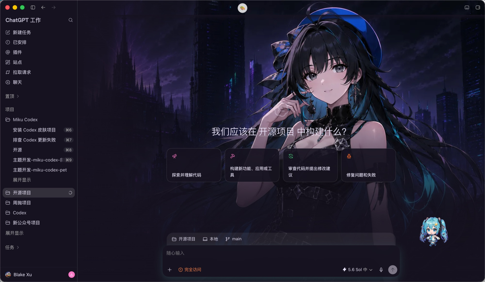
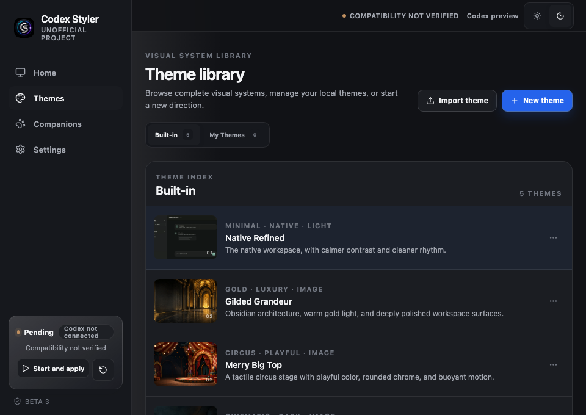
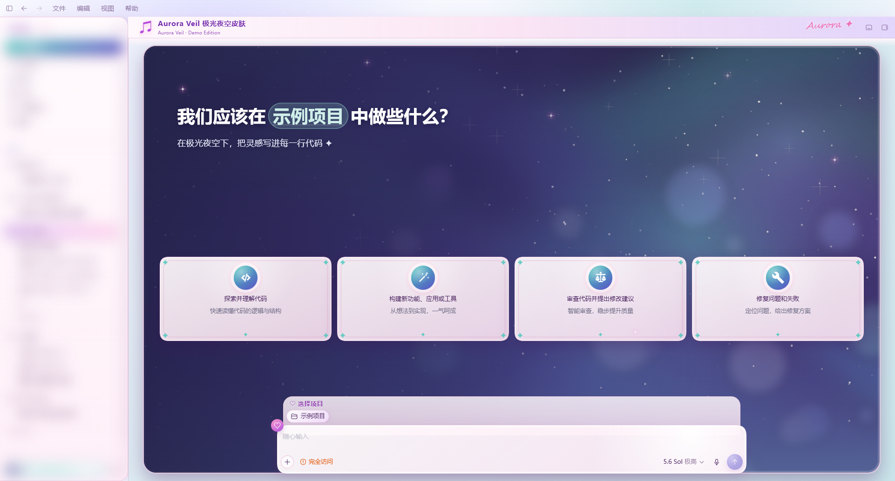
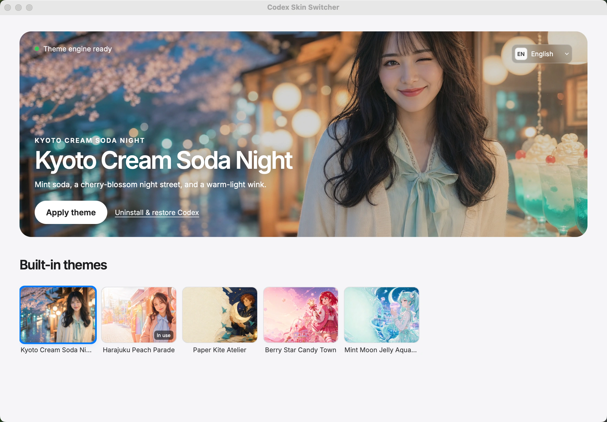
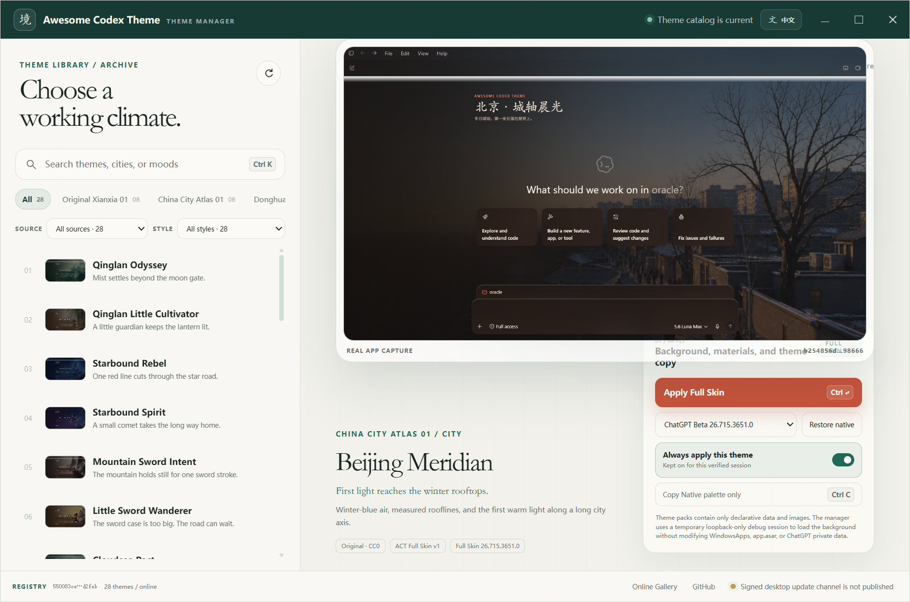
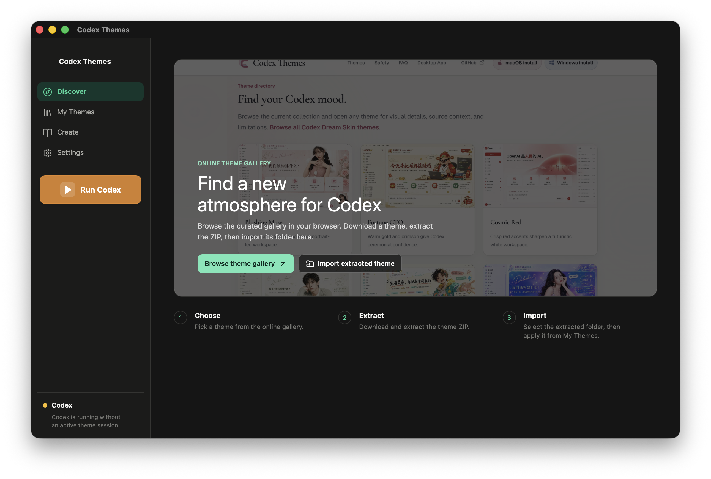

# Awesome Codex Skin

[English](README.en.md) | **中文**

> 一个面向 OpenAI Codex Desktop 的皮肤、主题、主题制作工具与运行时项目精选。

这里收录的是第三方开源项目，不代表 OpenAI 官方支持或安全背书。更换主题前，请先阅读项目的安装、还原和兼容性说明；涉及 CDP 或调试端口的工具尤其要只在本机可信环境中使用。

## 有真实界面截图的精选项目

以下项目均在其公开仓库中提供了实际运行界面截图。为了便于比较，预览图已随本仓库保存；每张图的原始地址、作者及适用许可证见 [ATTRIBUTION.md](ATTRIBUTION.md)。

| 项目 | 实际界面截图 |
| --- | --- |
| [HeiGe Codex Skin Studio](https://github.com/HeiGeAi/heige-codex-skin-studio) — 使用本机回环 CDP 注入的主题工作室，内置主题、自定义图片和一键还原。 |  |
| [Codex Styler](https://github.com/xuhuanstudio/codex-styler) — 可视化主题编辑器与皮肤创建器，提供主题库、伴侣和恢复入口。 |  |
| [Codex AutoSkin](https://github.com/Finderchangchang/codex-autoskin) — 将图片转换为皮肤的本地化工作流，项目提供主题实际运行示例。 |  |
| [CodeDrobe Desktop](https://github.com/CodeDrobe/desktop) — 面向 Codex 与 WorkBuddy 的可视化主题管理器，支持浏览、应用与恢复。 |  |
| [Codex-NN](https://github.com/slovx2/Codex-NN) — 跨平台的 Codex Desktop 可视化主题管理器。 |  |
| [codex-skin-switcher](https://github.com/bytefer/codex-skin-switcher) — 免费开源的跨平台主题/皮肤切换应用。 |  |
| [codex-theme-x](https://github.com/focuxdot/codex-theme-x) — 将图片转换为 Codex 主题的工具。 |  |
| [awesome-codex-theme](https://github.com/rwang23/awesome-codex-theme) — 无代码主题标准、注册表、校验器与画廊。 |  |
| [CodexThemes App](https://github.com/NBchitu/CodexThemes-App) — 主题发现、导入、切换、创建与恢复工具。 |  |

## 主题管理与换肤工具
- [piperhex/codex-switch](https://github.com/piperhex/codex-switch) — 一款本地优先的 Tauri 2 桌面应用，用于登录、保存和切换多个 Codex / ChatGPT 账号，并支持通过 Dream Skin 进行换肤。
- [houyuhang915-sudo/Codex-Skin-Manager](https://github.com/houyuhang915-sudo/Codex-Skin-Manager) — 跨平台的 Codex 主题管理器，支持主题切换、创建、导入和恢复原版，包含 macOS 和 Windows 版本，可通过对话创建主题。

- [HeiGe Codex Skin Studio](https://github.com/HeiGeAi/heige-codex-skin-studio) — macOS / Windows 主题工作室：内置预设、图片取色、主题中心与还原。
- [Codex Styler](https://github.com/xuhuanstudio/codex-styler) — 开源主题编辑器、主题库和 2D companion 工具。
- [Codex AutoSkin](https://github.com/Finderchangchang/codex-autoskin) — 由一张图片自动生成 Codex Desktop 皮肤的 agent-native 工具。
- [CodeDrobe Desktop](https://github.com/CodeDrobe/desktop) — Codex / WorkBuddy 桌面主题管理器与主题商店。
- [CodexNextTheme](https://github.com/pikapikaspeedup/CodexNextTheme) — macOS 一键换肤、微调、桌宠和主题商城工具。
- [Codex-NN](https://github.com/slovx2/Codex-NN) — 跨平台的 Codex Desktop 可视化主题管理器。
- [codex-skin-switcher](https://github.com/bytefer/codex-skin-switcher) — 免费开源的跨平台主题/皮肤切换应用。
- [codex-skin](https://github.com/charmber/codex-skin) — 支持背景、配色与主题的 macOS 换肤工具。

## 创建器与自动化
- [xuhuanstudio/codex-styler](https://github.com/xuhuanstudio/codex-styler) — 开源 Codex 主题编辑器与皮肤创建器，支持导入图片生成主题、可拖拽的 2D 伙伴，本地运行且完全可逆。

- [codex-theme-creator](https://github.com/swording-k/codex-theme-creator) — 用一句话或参考图创建、安装并验证 macOS Codex Desktop 主题。
- [codex-autoskin](https://github.com/hsir2411-dotcom/codex-autoskin) — 从图片自动生成定制皮肤，强调不修改应用核心文件。
- [codex-theme-x](https://github.com/focuxdot/codex-theme-x) — 将图片转换为 Codex 主题的工具。
- [Codex Dream Skin Studio](https://github.com/huoxuhaohaode/Codex-Dream-Skin-Studio) — 可视化创建、切换和分享 Codex Desktop 主题的工具。
- [SkinDex / codex-qq-skin](https://github.com/angziii/codex-qq-skin) — 声明式皮肤包的校验、安装与本机回环 CDP 运行时。

## 运行时、规范与主题包
- [CCDawn/Codex-Dream-Skin-Enhanced](https://github.com/CCDawn/Codex-Dream-Skin-Enhanced) — 给 Codex 桌面端换上主题、静态壁纸和动态壁纸的一键式管理器，支持 Windows 和 macOS，可恢复官方外观。

- [CodeDrobe Core](https://github.com/CodeDrobe/core) — 可逆主题运行时，提供 CLI、应用适配器、CDP 注入与验证能力。
- [CodeDrobe Skills](https://github.com/CodeDrobe/skills) — 从参考图到验证、修复、发布的主题 Agent Skills。
- [awesome-codex-skins](https://github.com/Wangnov/awesome-codex-skins) — `.codexskin` 主题标准、工具链与主题画廊。
- [awesome-codex-theme](https://github.com/rwang23/awesome-codex-theme) — 无代码主题标准、注册表、校验器与画廊。
- [codex-skin-packs](https://github.com/ChannelerH/codex-skin-packs) — 带有清理过预览图与 `theme.json` 的主题包集合。
- [codex-dream-skin-themes](https://github.com/aaronfang/codex-dream-skin-themes) — 可分享的 macOS Dream Skin 主题包。

## 更多目录与社区
- [TIANQIAN1238/codex-skin-gallery](https://github.com/TIANQIAN1238/codex-skin-gallery) — 免费开源的 Codex Desktop 社区皮肤聚合站，收录 150+ 套皮肤并提供安装指引与来源署名。
- [skindex](https://github.com/0xagata-prog/skindex) — Codex 主题与皮肤聚合目录，并提供独立 Theme Hub Skill。
- [awesome-codex-themes](https://github.com/acvnace/awesome-codex-themes) — Codex 主题、皮肤、画廊与工具的另一份精选目录。
- [CodexThemes App](https://github.com/NBchitu/CodexThemes-App) — 主题发现、导入、切换、创建与恢复工具。

## 收录标准

欢迎提交 Pull Request。为保持目录有用，请确保项目：

1. 明确服务于 OpenAI Codex Desktop 的主题、皮肤或相关工作流；
2. 有公开仓库、清晰的安装/还原说明和许可证；
3. 说明是否修改官方应用文件、是否使用 CDP，以及支持的平台；
4. 如果有真实运行截图，请提供稳定的仓库内路径与授权信息，优先展示。

## 许可证

本仓库的索引文本采用 [MIT License](LICENSE)。预览图不随此许可证重新授权，仍分别受其来源项目的许可证和权利说明约束，详见 [ATTRIBUTION.md](ATTRIBUTION.md)。
